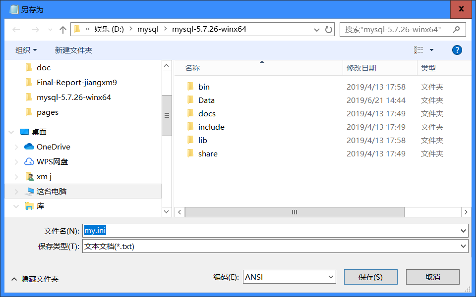

# 关于Windows配置MysqlServer时遇到的问题及个人的解决办法

### 系统分析与设计课程技术分享博客

---

这次系分项目我分配到了后端部分，我们后端小组选用的技术方案是PHP + Nginx + Mysql，安装PHP和Nginx的环境按照网上已有的教程一步步做下来就好了，csdn上有很多介绍怎么配置PHP + Nginx的，具体参考的是这一篇博客 'https://blog.csdn.net/gfj0814/article/details/76400778' 。

但在Mysql部分就发现我的workbench左下角显示 'no connection' ，搜了下发现是自己的mysql服务没有开启，然而自己不管是在服务里点击启动还是通过命令行都死活开启不了mysql服务，一直是”本地计算机上的mysql服务启动后停止“，或者就卡在”正在启动mysql服务“。

经过各种尝试最后还是只能用终极办法：把mysql整个卸载了，然后重装一个新的。重装时为了轻便就只安装了Mysql Server，具体安装过程参考了这篇博客 'https://www.jianshu.com/p/ac4b90f16d2d' ,但发现依然卡在了“正在启动mysql服务”，最后发现是我修改my.ini文件时默认编码格式是UTF-8，导致无法初始化，最后把my.ini文件的编码格式通过笔记本更改为ANSI就能成功启动mysql服务了。具体更改方法如下：
- 使用记事本打开mysql.ini
- 在左上角的文件选择另存为
- 在弹出的框中可以选择编码格式，更改为ANSI即可

