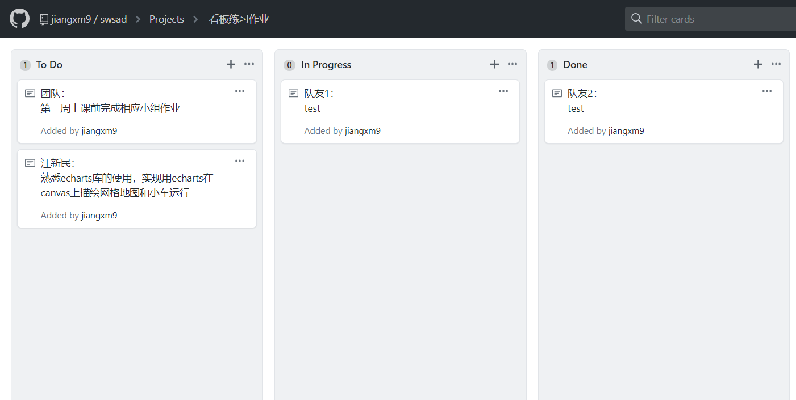
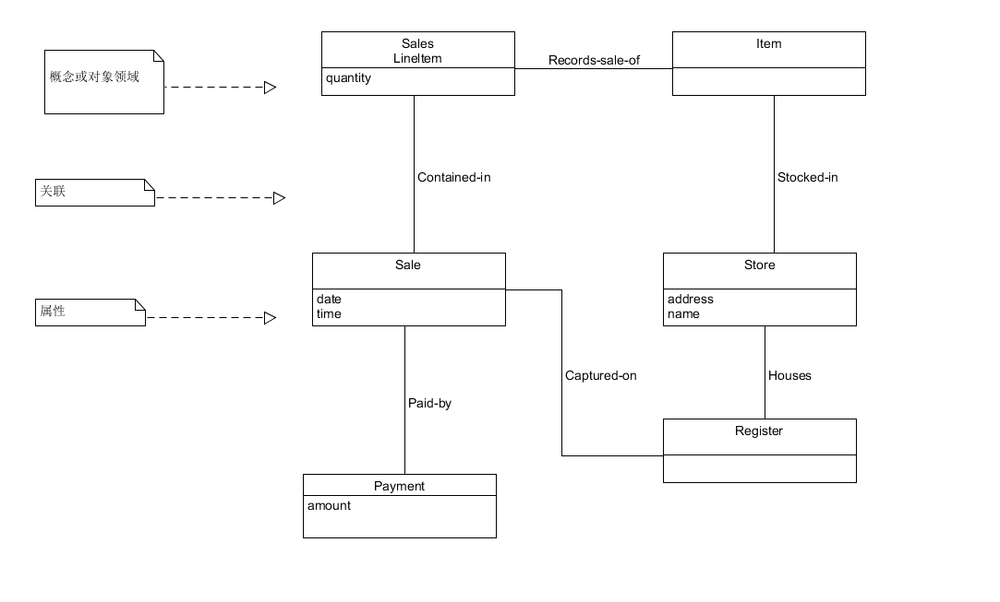

1. 简答题
- 用简短的语言给出对分析、设计的理解。
    - 分析：强调对于问题和需求的调查和研究，不是拿出解决方案
    - 设计：强调根据需求得到对于对象项目的大致解决方案
- 用一句话描述面向对象的分析与设计的优势。
    - 强调对象的概念，以对象为中心，分析与设计更符合人的思考方式。
- 简述 UML（统一建模语言）的作用。考试考哪些图？
    - UML是一种开放的方法，用于说明、可视化、构建和编写一个正在开发的、面向对象的、软件密集系统的制品的开放方法
    - 考试考 
        1. 用例图 
        2. 静态图（ 类图 对象图 包图） 
        3. 行为图（ 交互图 顺序图 合作图 状态图 活动图）
        4. 实现图 （构件图，部署图）
- 从软件本质的角度，解释软件范围（需求）控制的可行性
    - 软件的本质特性包括复杂性，一致性，可变性和不可视性，所以我们只能对于软件的工期，范围，质量和预算进行尽可能的控制并围绕客户目标不断迭代以满足客户需求。
2. 看板练习

3. UML绘图工具练习
  
《UML和模式应用》第100页图9-2：部分领域模型：可视化字典
