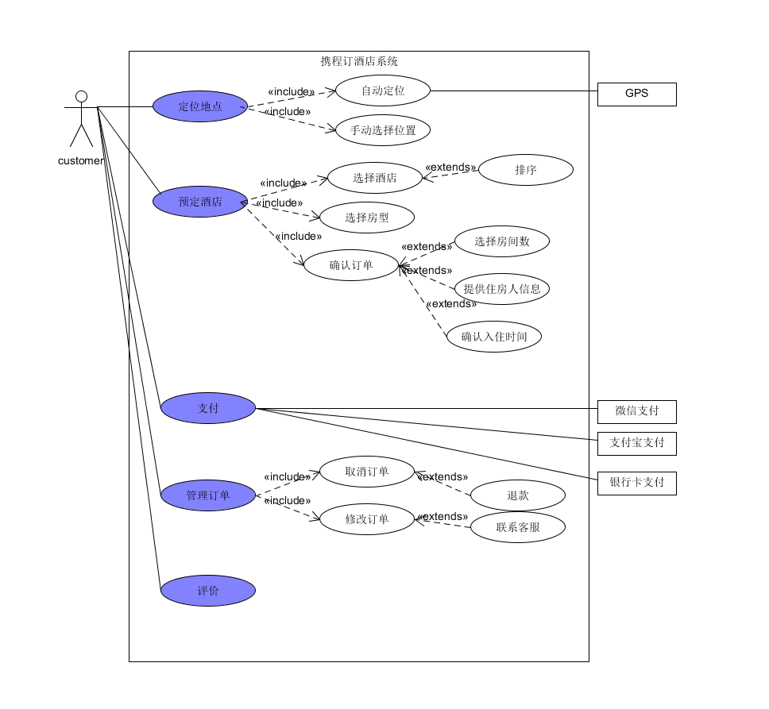
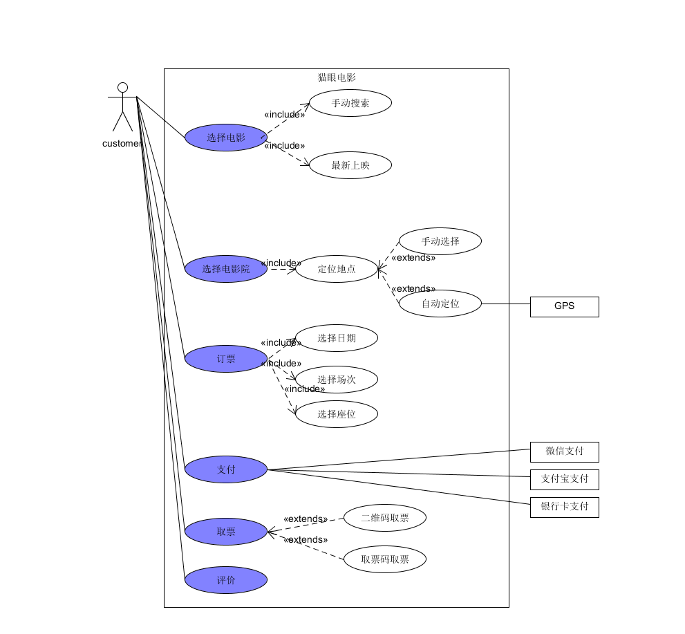

1. 简答题
    #### 1. 用例的概念
    - 用例是指一组用户使用一个系统实现一个目标的成功或失败的场景。是一种通过用户的使用场景来获取需求的技术。
    #### 2. 用例和场景的关系？什么是主场景或 happy path？
    - 用例和场景的关系：每一个用例包括了许多个场景，场景中包含了用户是如何与系统进行交互，即谁可以利用系统做什么事情。
    - 主场景：每一个用例中都包含一个主场景，主场景对应于系统主要的交互，通常是指成功的场景。
    - happy path: 在测试用例时没有出现预期之外结果的场景。在用例建模中，happy path是主执行者完成了目标，所有有关人员的需求都得到了满足。
    #### 3. 用例有哪些形式？
    - 简要格式（Brief）：简洁的总结，通常是主要的成功场景，能够很快的做出。
    - 简便格式（Casual）：包含很多场景的简要的提醒性质的用例。
    - 完整正式的格式（Fully）：完整的，包括所有步骤的，并且经可能使用例详尽的格式。 
    - 双列表格式
    - 单列表格式
    - RUP格式
    #### 4. 对于复杂业务，为什么编制完整用例非常难？
    - 复杂业务对应的场景也多，所以需要实现的用例也很复杂。
    #### 5. 什么是用例图？
    - 用例图：是指由参与者、用例,系统边界以及它们之间的关系构成的用于描述系统功能的图。
    #### 6. 用例图的基本符号与元素？
    - 系统框：框内表示待研究的系统
    - 人：表示参与者
    - 椭圆：表示一个用例
    - 箭头：表示参与者与用例或用例与用例之间的交互关系。其中有include 和 exclude
    #### 7. 用例图的画法与步骤
    - 需求识别：确定研究对象，需要研究一个什么样的系统
    - 识别参与者：确定系统中的参与者，其中包括主要参与者，协作参与者，幕后参与者
    - 识别用例：确定需要研究的系统中的用例和服务，区分用户级别的用例和子用例
    - 建立用例与参与者之间的关系
    #### 8. 用例图给利益相关人与开发者的价值有哪些？
    - 用例强调了用户的目标和观点，使得用户能够更多地参与到系统的设计当中去，保证系统按照用户的需求进行设计。而用例图则将用例图形化、具象化了，使得整个系统中用例、参与者之间的关系更加清晰地表达出来。
    - 用例能够根据需要对复杂程度和形式化程序进行增减调节，即能够响应用户提出的需求，而用例图则使得这种调节更加便利，可以通过修改图形间的关系实现。
    - 用例图使得开发者能够更明确地获得需求，更好地理解需求。
    - 用例图可以指导开发和测试，同时可以在整个过程中对其他工作流起到指导作用。
2、建模练习题（用例模型）
    - 选择2-3个你熟悉的类似业务的在线服务系统（或移动 APP），如定旅馆（携程、去哪儿等）、定电影票、背单词APP等，分别绘制它们用例图。并满足以下要求：
        - 请使用用户的视角，描述用户目标或系统提供的服务
        - 粒度达到子用例级别，并用 include 和 exclude 关联它们
        - 请用色彩标注出你认为创新（区别于竞争对手的）用例或子用例
        - 尽可能识别外部系统和服务
    - 携程订酒店Umlet
  
    - 猫眼订票Umlet
  
    - 然后，回答下列问题：
        #### 1. 为什么相似系统的用例图是相似的？
        - 在相似的系统中，用户的预期目标是一样的，不用的系统需要达到用户期望的目的是一样的。如订票系统都需要用户提供时间、地点、票的类型等。为了提供相似的服务，相似的系统之间的用例图也是相似的。
        #### 2. 如果是定旅馆业务，请对比 Asg_RH 用例图，简述如何利用不同时代、不同地区产品的用例图，展现、突出创新业务和技术
        - 从技术的角度出发：当下订旅馆业务的软件，，更最求效率和速度，相比于Asg_RH用例图，当下订旅馆的无疑拥有更好的筛选系统，可以更加快速的选择自己想要的旅馆。
        - 从业务创新的角度出发：相比于传统，当下的订旅馆扩展和创新了很多业务，如增加房型，变更提供房间的方式，这些都使得用户的选择更多，用户体验更好。
        - 从时代的角度出发：当下订旅馆业务呈现多元化，并且在用户的信息保护上有了很大的突破和进展。
        #### 3. 如何利用用例图定位创新思路（业务创新、或技术创新、或商业模式创新）在系统中的作用
        - 依据用例图中的每一个用例可以很清楚的知道，当前用例是其他系统所没有的，即创新点
        - 依据创新用例在用例图中的关系和位置，可以很清楚的知道，创新用例依据的外部系统或者从属关系，很好的定位其服务方式和服务场景，发挥更好的服务效果。
        #### 4. 请使用 SCRUM 方法，选择一个用例图，编制某定旅馆开发的需求（backlog）开发计划表

| ID | Name | Imp | Est | How to demo | Notes |
| :------------: | :-------------: | :------------: | :-------------: | :-------------: | :-------------: |
| 1 | 定位地点 | 9 | 4 | 用户输入地点或者自动定位 | 需要使用GPS定位用户位置 |
| 2 | 预定酒店 | 9 | 5 | 用户选择酒店，选择房型，确认订单并选择房间数，提供入住人信息和入住时间 | 需要针对不同的需求排序 |
| 3 | 支付 | 10 | 3 | 用户支付已确认订单 | 支持第三方支付 |
| 4 | 管理订单 | 8 | 2 | 用户可以修改订单或者取消订单 | 修改订单需要联系客服并确定酒店能进行更换否则只能取消订单并退款 |
| 5 | 评价 | 7 | 1 | 入住后用户可以给酒店评价 | 保证评价的真实性和隐私性 |

#### 5. 根据任务4，参考 使用用例点估算软件成本，给出项目用例点的估算  

| 用例 | #业务 | #计算 | 原因 | UC比重 |
| :------------: | :-------------: | :------------: | :-------------: | :-------------: |
| 定位地点 | 4 | 8 |  | 简单 |
| 预定酒店 | 5 | 10 |  | 平均 |
| 支付 | 8 | 16 | 框架 | 平均 |
| 管理订单 | 6 | 12 | | 平均 |
| 评价 | 3 | 6 |  | 简单 |

