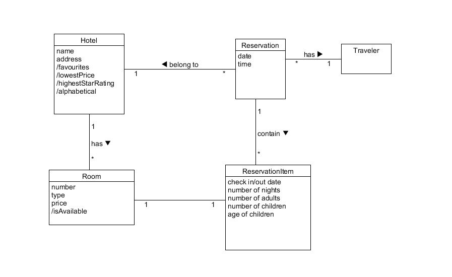
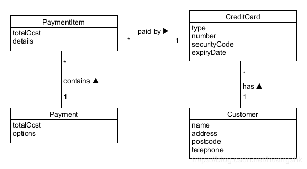
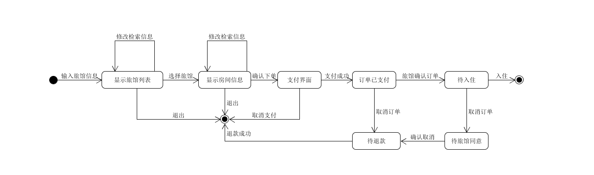
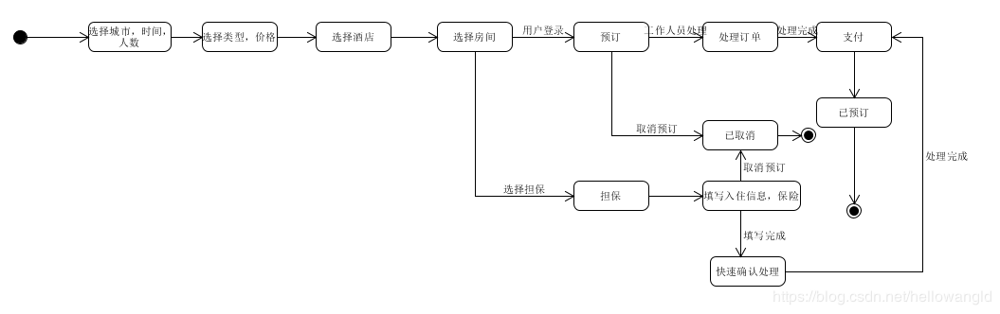

1. 使用类图，分别对 Asg_RH 文档中 Make Reservation 用例以及 Payment 用例开展领域建模。然后，根据上述模型，给出建议的数据表以及主要字段，特别是主键和外键
    - 注意事项：
        - 对象必须是名词、特别是技术名词、报表、描述类的处理；
        - 关联必须有多重性、部分有名称与导航方向
        - 属性要注意计算字段
    - 数据建模，为了简化描述仅需要给出表清单，例如：
        - Hotel（ID/Key，Name，LoctionID/Fkey，Address…..）
    - 对Make Reservation建模  
      
    - 对payment建模  
      
    - 数据建模
        - Hotel (ID/Key, Name, Address, isFavourites, isLowestPrice, isHighestStarRating, isAlphabetical)
        - Traveler (ID/Key, Name, Email)
        - Room (ID/Key, HotelID/FKey, Number, Type, Price, isAvailable)
        - Reservation (ID/Key, TravelerID/FKey, Data, Time)
        - ReservationItem (ID/Key, ReservationID/FKey, HotelID/FKey, CheckInDate, CheckOutDate, NumsOfNights, NumsOfAdults, NumsOfKids, AgesOfKids )
        - Payment (ID/Key, ReservationID/FKey, TotalCost, Options)
        - PaymentItem (ID/Key, PaymentID/FKey, TotalCost, Details)
        - CreditCard (ID/Key, CustomerID/FKey, Type, Number, SecurityCode, ExpiryDate)
        - Customer (ID/Key, Name, Address, Postcode, Telephone)

2. 使用 UML State Model，对每个订单对象生命周期建模
    - 建模对象： 参考 Asg_RH 文档， 对 Reservation/Order 对象建模。
    - 建模要求： 参考练习不能提供足够信息帮助你对订单对象建模，请参考现在 定旅馆 的旅游网站，尽可能分析围绕订单发生的各种情况，直到订单通过销售事件（柜台销售）结束订单。
    - 参考Asg_RH的建模  
      
    - 参考携程旅游网定旅馆的建模  
      
